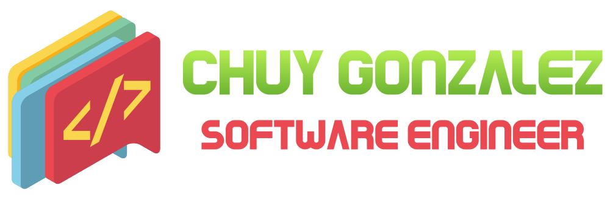

## About Me 🚀

I am a Software Engineer, working with C#, JavaScript and I'm focusing on Microservices, DevOps, Web and PWA.

  

## Connect with me 📇

          

## Languages and Tools 🛠️

                      <a href="https://nodejs.org" target="_blank">       

## Achievements 🏅

- Postman Student Expert: 

## Analytics 📈

